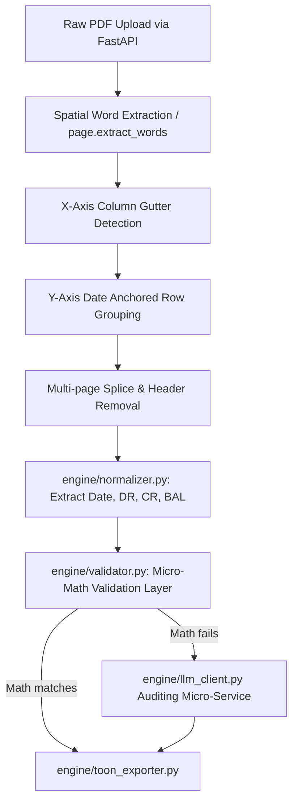

# Redesigning the FIU Bank Statement Analyzer (backend/engine)

This document serves as the exact root-cause analysis and step-by-step deterministic implementation plan to reconstruct the backend engine (`D:\developer\FFA\bank_statement_analyzer\backend`) into a high-integrity, production-ready system.

## User Review Required

> [!WARNING]
> Please review this root-cause analysis and the proposed pipeline thoroughly. Executing this plan will require deprecating the heavy LLM extraction prompt inside `engine/llm_client.py` and replacing the naive `pdfplumber.extract_tables()` logic in `engine/parser.py`. The LLM will be relegated solely to auditing mathematically corrupted rows.

---

## 1. 🔍 Root Cause Analysis (Code Level)

I have deeply inspected your specific `bank_statement_analyzer` architecture, including `engine/parser.py`, `engine/llm_client.py`, and `engine/validator.py`. Here are the exact reasons the current system is fragile, exhausting, and hallucinates data:

1. **LLM as the Primary Extractor (`llm_client.py`)**: 
   In `llm_client.py`, your `EXTRACTION_PROMPT` asks the LLM (Groq, OpenRouter, etc.) to extract an entire page into a massive JSON array calculating the Date, Narration, UTR, Debit, Credit, and Balance. 
   **Why it fails:** LLMs are language guessers, not calculators. On pages with 40-50 dense rows, they suffer from "Attention Drop-off" (silently skipping 10 rows in the middle) and token hallucination (turning `10,005.0` into `1005.0`). This destroys mathematical integrity.
2. **Ghost Grids in the Legacy Parser (`parser.py`)**: 
   When falling back to or running `parser.py`, you use `page.extract_tables()`. This is notorious for bank statements because it relies heavily on visual ruling lines or perfect whitespace. If a narration wraps to three lines without vertical borders, `pdfplumber` crushes the Debit and Credit columns together or completely splits a single transaction into multiple rows.
3. **No Row-by-Row Mathematical Healing (`validator.py`)**: 
   Your `ExtractionValidator` checks if `Opening + Credits - Debits ≈ Closing`. While this is excellent as a final macro-gate, it doesn't solve the micro-problem. If it fails, the page is rejected or manually investigated, instead of the system automatically hunting down *which specific row* caused the math failure to fix it.

## 2. 🧩 Current Pipeline Breakdown & Failure Points

**Current Sequence:**
1. **Routing**: `main.py` checks `is_text_usable()`.
2. **Heavy Lifting**: 
   - **Path A (LLM)**: Sends the whole page text or base64 image to the LLM. *(Failure: Context window limits, skipping rows, digit hallucination).*
   - **Path B (Parser)**: `extract_tables()` loops over tables. *(Failure: Merges columns, orphaned multiline descriptions).*
3. **Normalizer**: `normalizer.py` applies regexes to parse out UTRs from the LLM output.
4. **Validation**: `validator.py` checks macro-level math and REJECTS if it's off. *(Failure: High rejection rate because it cannot auto-heal).*

## 3. ❌ Remove LLMs & Naive Extraction from Core

To achieve 100% deterministic tracking, we must use the **Coordinate Canvas Strategy** as the single source of truth inside `parser.py`.

* **Extract Text WITH Coordinates:** Instead of `.extract_tables()`, use `page.extract_words()`. This returns `{text, x0, x1, top, bottom}` for every word.
* **Detect Columns (X-axis clustering):** Calculate the density of `x0` coordinates. Standard columns (Date, Withdraw, Deposit, Balance) form high-density vertical "gutters". We lock these X-boundaries.
* **Detect Rows:** Use mathematical grouping based on `top` coordinates (Y-axis), anchored by Dates. 

## 4. 🧠 Row Detection Strategy (CRITICAL)

**The Anchor-Date Strategy:**
1. Sort all extracted words on a page by `top` (Y-axis), then `x0` (X-axis).
2. Group words with similar `top` bounds (e.g., within 2 pixels) into a `PhysicalLine`.
3. Scan `PhysicalLine`s top to bottom.
4. If a line has a word matching `DATE_RE` originating in the **Date Column X-bounds**, **Create a New Transaction Group**.
5. If the next `PhysicalLine` does NOT have a Date in the Date Column, it is a wrapped narration. **Append its text to the narration of the current Transaction Group.**
6. Continue until a new Date anchor restarts the cycle.

## 5. 📄 Multi-Page Handling

If you process pages in isolation (as currently happens loop-by-loop in `llm_client.py`), you drop data.
1. **Header/Footer Removal:** Scan the `PhysicalLine`s from the top until a line contains table headers ("Date", "Narration"). Strip everything above it. Strip everything below the lowest horizontal rule.
2. **Page-Break Transactions:** When Page 2 begins, check its first `PhysicalLine`s. If they do not start with a `Date` anchor, those lines **belong to the last open transaction on Page 1**. We push them back across the page boundary.
3. **Carry-Forward Exclusions:** After rows are constructed, scan descriptions for "B/F", "Brought Forward", or "Opening Balance". Skip these macro-rows to prevent doubling the balance.

## 6. 🔢 Mathematical Validation Layer (The Gateway)

This becomes the new core of `validator.py`. Instead of just a pass/fail at the end, it traces the ledger:

1. **Calculate State:** For every parsed row, take `Previous_Row_Balance`.
2. **Evaluate Math:** `Expected_Balance = Previous_Row_Balance - Debit_Col + Credit_Col`.
3. **Check:** `abs(Expected_Balance - Extracted_Balance) <= 0.02`
4. **Identify Failure Region:** If Math fails, it means one of the rows is corrupted. The failure region is marked between the last structurally valid balance and the next valid balance.
5. **Trigger Correction:** Mark *only the exact region of corrupted strings* to be sent to the isolated LLM Auditor.

## 7. 🤖 LLM Auditor Design (STRICT MODE)

We ONLY invoke `llm_client.py` for rows where the Mathematical Validation failed.

**Input Schema (`engine/llm_client.py` redesign):**
```json
{
  "objective": "You are a forensic math auditor. Correct the missing values so the ledger balances.",
  "opening_balance_target": 15000.50,
  "closing_balance_target": 14500.50,
  "broken_raw_text": "12/04 PAYTM TRANSFER 500  ", 
  "extracted_thus_far": {"date": "12/04", "debit": null, "credit": null, "balance": null}
}
```

**Rules Configured inside Prompt:**
* NEVER add transactions that are not supported by the raw text.
* Return ONLY JSON adhering to the target schema.
* (Temperature remains at 0.0).

## 8. ⚠️ Failure Points List (Hidden System Risks)
* **X-Axis Shifting**: Bank statements sometimes shift columns by 2-5 pixels on later pages. Column X-boundaries must be recalculated per page.
* **Over-reliance on `is_text_usable`**: OCR artifacts will still bleed into the text path. The Spatial Validator ensures that even OCR garbage gets mathematically verified.
* **Negative Formatting**: Balances overdrawn may format as `15,000.50 Dr` or `(15,000.50)`. Your normalizer MUST accommodate trailing/trailing signifiers.

## 9. 🏗️ Final Architecture



## 10. 🧠 Implementation Strategy (Step-by-Step)

### Step 1: Fix First (Rip out the heuristic core)
* Re-write `engine/parser.py` to use a coordinate-mapping function (e.g., `pdftotree` logic or custom x-density columns) instead of `.extract_tables()`.

### Step 2: What to Remove
* Deprecate the massive extraction prompt inside `engine/llm_client.py`.
* Remove all code that attempts to pass a full PDF page to the LLM.

### Step 3: What to Rebuild
* **Rebuild `engine/parser.py`** to construct `PhysicalLine` objects from words, anchor them via Date regex at the 0-100 `x` coordinate boundary, and pass them down as distinct, column-aware objects.
* **Upgrade `engine/validator.py`**: Inject the `LedgerValidator` runtime that does running-balance tests on the intermediate rows, rather than just the final macro-balance.

### Step 4: Testing Correctness
* **Unit Testing:** Run `run_validation.py` on your worst PDFs. If the `LedgerValidator.get_ending_balance() != Ground_Truth`, the test fails. Because it runs deterministically, you can step through line-by-line in a debugger without waiting for Groq API returns.

---

## Open Questions

1. Which file in the `backend/engine` folder would you like to rebuild first? The deterministic `parser.py` using Coordinate Canvas, or reshaping `llm_client.py` to handle the micro-audits?
2. Do we have a repository of structurally complex PDFs inside `inputs/` we can use as unit tests while writing the Coordinate Canvas?
